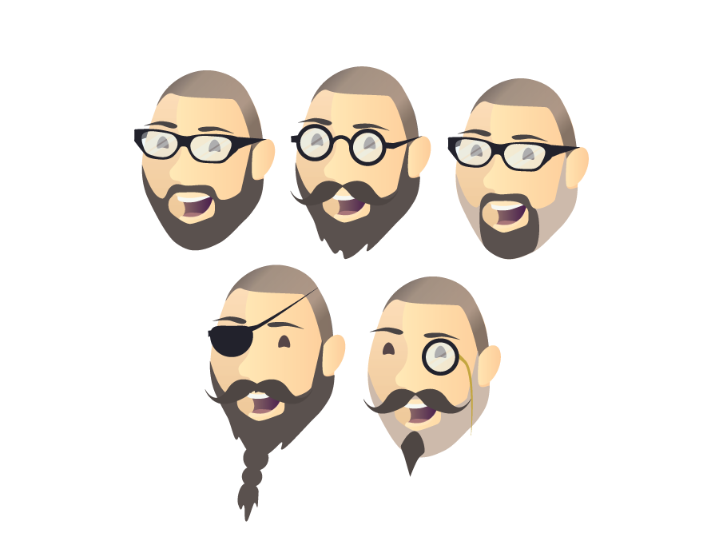

#Uncommon Knowledge

During the first week of the branding project we were given a basic brief; entailing of Christopher Murphy’s new idea of a business, which is teaching lessons and writing a series of books, and we had to create the brand. Uncommon Knowledge was the name of the brand we had to design for, we were given the task to figure out what Chris actually wanted for this Company, such as; did he want a wordmark, monogram, icon…
We were set into groups of three, our group was called ‘group eclipse’. We set to doing a basic brainstorm on the name of the company and the book names, which tailed onto simple sketches of ideas. The first thing that came to my head was a character of Chris, since is was about him teaching people, he needed to grab peoples attention. We were told that we had a 15 minute discussion with Chris to get more in depth and information on what he wanted for the following week, so as a group we decided to great basic concepts and book covers for this, so Chris could give us some feedback. 

Chris had told us that he wanted pattern and bright vibrant colours for his brand, he also went through a few flat form designs that caught my eye, as that is what I am quite interested in. I thought pattern was a tad old fashioned for his target age group, which was; young adults, people who just graduated from university. I also thought pattern had a bit too much of a textbook look to it. Flat form design on the other hand, was a definite road I was going to follow, as I think many people around the target age like that style, including myself. So I went straight to Pinterest to get some inspiration. 

##Uncommon knowledge Research

####Top web searches for uncommon knowledge:

- Psychology and hypnosis trainging - http://www.uncommon-knowledge.co.uk and http://www.unk.com

- A Web series in which political leaders, scholars, journalists, and today's big thinkers share their views with the world - http://www.hoover.org/publications/uncommon-knowledge

- A Company that helps develop marketing programs with clients -http://www.uncommon-knowledge.net/what-we-do/ 

###Companies like Uncommon Knowledge

####Paul Jarvis
- Paul Jarvis - http://pjrvs.com - http://thecreativeclass.io

Paul Jarvis is a successful web designer, best-selling author and a man with a reputation. He has worked for many large companies such as, Microsoft, Yahoo and Mercedes-benz.  Paul Jarvis holds creative classes for budding freelancers, teaching them the practical skills of running a soul-traded business using his 16+ years experience of freelancing involvement.  

**Web design and Icons**

The simplistic style Paul Jarvis has used on his creative class website to sell his courses to the public, is easy on the eye and professional. He has used a light blue throughout the website, which displays a professional and clear outlook. His icons used on the page have a flat form design, using just the colours navy, white and blue. They are easy to understand and detailed, but not that detailed that they would look messy and not be consistent with the page.

####Lighthouse Labs

- https://www.lighthouselabs.ca/program?gclid=CjwKEAiA9qCnBRCb7ZDhvaHSyicSJABGFFHtDmrM9vsFyBK7NJ4u_ebE_pIn6WnyGnuxkRIES-tZ4BoCm6Hw_wcB

####Treehouse

####A book apart

 Interactive learning courses on the internet

####The psychology series

Selling books as a series, making books and courses seem like a series and a collective, so buying one means you have to buy all.

####Jonathan Snook 

Scalable and modular architecture of CSS. Get smacked.

####Nathan Barry

Nathanbarry.com.authority, made over 150 thousand from self promoting books.

My Initial book cover ideas to put across why flat design is better than pattern:

During the second week as a group we had decided to create a small keynote presentation for the meeting with Chris. The Keynote contained flat form design images that I had came across such as characters and icons which I thought looked quite quirky and contemporary, also some icons that I found on dribble. During the meeting, Chris really loved the flat form design idea as we had explained we chose it over pattern as it was more current and would attract the target market, we had simple book cover designs to prove that flat was the style to go for, which he agreed completely to. I also presented Chris some logo and book cover concepts that I had sketched.

During this week everyone had to stop working in groups, but since our group got along and had good ideas, we stayed as a group. I created a flat from design character of Chris, using block colour and not overly detailed features. From my initial ideas and sketches I used the idea of beard growth to show progression throughout the books, so I created various versions of the character with different beards, I thought that we could make it quite humorous as Chris would be, so we could have different glasses, beards and expressions. Also one of the things that Chris thought would be good to work with would be his swearing, as he would swear quite frequently. But I was unsure about this as it might put off people before they even read the content within the book and understand his personality, so quite literally judging a book by its cover. So I thought you could have a swear word on the spine of the books, so once you had collected the whole series, it would make out a blurted out swear word, so once you understood his personality you would then comprehend his vocabulary.

During this week we had another meeting with Chris, we had decided to do this meeting as group, we created another keynote presentation to show Chris what we had created, I presented him my flat design version of him that he had liked, but he was unsure about the eyes, because there were none. I completely understood why he didn’t like that you couldn’t see the characters eyes, as the eyes show personality and are a window to a persons soul. He also was didn’t like the glasses shape as they were too hipster, so he told me to look at his glasses, they were same glasses the famous chef Heston Blumenthal wore. He also said to look at other glasses shapes such as circular glasses. He also said to bring in his tweed jacket, as he always wears it during important conferences and presentations, as it is his iconic look.

I completely changed the character of Chris, as I thought it lacked personality. I searched dribble and Pinterest. Using illustrator I created the character, when creating his face I used a slight gradient, making sure it wasn’t overly noticeable but enough that it would give depth to the face but not making it look too realistic. I created his exact glasses instead of the typical hipster style glasses; I also created other variations of glasses. I created various beard styles as well. I went back through my sketches and found an idea that I had for a wordmark that I quite liked so I created it also, It consisted of a light bulb  / flipped question mark that replaced the ‘C’ and ‘O’ or ‘Uncommon Knowledge’.

I decided to use the font ‘Steelfish’ for the text that would be used for the brand, as Chris said he wanted a plain sans serif font that would look modern and contemporary, also it wouldn’t look messy or overpower against the character. 

